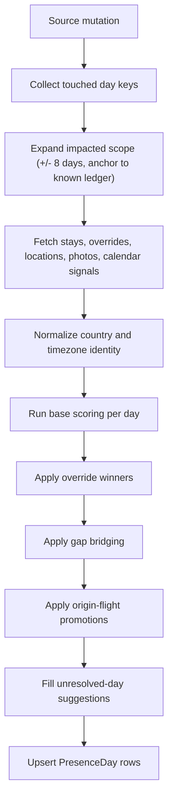

# Presence Inference PRD

- Status: Draft
- Last updated: March 21, 2026
- Scope: BorderLog daily country inference driven by stays, day overrides, calendar events, photos, and location samples
- Primary implementation references:
  - `Shared/PresenceInferenceEngine.swift`
  - `Shared/LedgerRecomputeService.swift`
  - `Shared/CalendarSignalIngestor.swift`
  - `Shared/PhotoSignalIngestor.swift`
  - `Shared/LocationSampleService.swift`
  - `LearnTests/InferenceEngineTests.swift`

## 1. Purpose

BorderLog must maintain a daily presence ledger that answers a single product question for every calendar day in scope:

> Which country was the user most likely in on this day, how confident are we, and why?

This PRD defines the implemented inference system, not an aspirational future model. It captures the real sequencing, scoring rules, post-processing passes, explainability outputs, and edge-case handling currently required for the product to behave consistently.

## 2. Product Outcome

The system produces one `PresenceDay` record per calendar day. Each record contains:

- resolved country code and country name, or `Unknown`
- numeric confidence and `high` / `medium` / `low` label
- evidence-source mask
- source counts by type
- dispute metadata when the day is contested
- suggestion metadata for unresolved days

The ledger is used downstream for:

- Schengen and country counting
- calendar/day detail UI
- dispute review
- exports and summaries
- correction workflows

## 3. Scope

### In scope

- manual stays spanning one or more days
- manual day overrides
- location samples captured by app or widget
- photo-derived location signals
- calendar-derived location signals from flight-like events
- country-code and country-name canonicalization
- day-key and timezone normalization
- impacted-range recomputation and persistence
- confidence labeling, dispute detection, gap filling, and adjacent-flight promotion

### Out of scope

- always-on background location tracking
- probabilistic or ML-based learning
- city-level inference
- multi-country fractional day allocation
- legal/compliance advice
- using server-side user travel data

## 4. Core Principles

- Local-first: all inference runs on-device.
- Explainable: every resolved day must be auditable back to source types and counts.
- Deterministic: same inputs produce the same day result, timezone, and dispute state.
- Correctable: manual day overrides always win, and manual stays strongly anchor the ledger.
- Minimal change scope: when data changes, recompute only the impacted window plus required padding.

## 5. Source Model and Subfeatures

| Source | Stored model | Key subfeatures | Day assignment | Dedupe / identity | Base scoring role |
| --- | --- | --- | --- | --- | --- |
| Manual stay | `Stay` | inclusive entry/exit range, ongoing stays, canonical day timezone | each covered day in the stay timezone | no unique key; user-managed records | strongest additive signal |
| Manual day override | `DayOverride` | single-day correction, precedence over all other sources | explicit day key | unique `dayKey` | terminal winner |
| Location sample | `LocationSample` | single capture, burst capture, widget pending queue, country/timezone resolution | `DayKey` from capture timestamp in resolved timezone | appended samples | high-quality additive signal weighted by accuracy |
| Photo signal | `PhotoSignal` | incremental scan, full scan, asset hashing, location-only ingestion | `DayKey` from asset creation date in resolved timezone | unique `assetIdHash` | medium additive signal |
| Calendar signal | `CalendarSignal` | flight detection, destination-first parsing, origin-side promotion signal, stale cleanup | `DayKey` from selected event date in resolved timezone | unique `eventIdentifier` | low additive signal plus special flight post-pass |

### 5.1 Manual stays

- Stays are normalized to a canonical day timezone at creation.
- Entry and exit are inclusive.
- Ongoing stays extend through the recompute range end.
- Every covered day receives the stay score for the stay country.

### 5.2 Manual day overrides

- Overrides represent an explicit user correction for one day.
- Override days still retain counts from matching underlying evidence, but the override country wins unconditionally.
- Override confidence is always `1.0 / high`.

### 5.3 Location samples

- Samples can be captured from the app or widget.
- Widget captures are queued as pending snapshots and ingested when the app becomes active.
- Burst capture stores up to the selected number of best-accuracy points, but uses the best location’s resolved country/timezone for the stored burst.
- Each stored sample carries timestamp, coordinate, accuracy, day key, timezone, and resolved country.

### 5.4 Photo signals

- Only photos with both creation date and location participate.
- Asset identifiers are SHA-256 hashed before persistence.
- Ingestion modes:
  - `auto`: scan since the last checkpoint, or last 12 months when no checkpoint exists
  - `manualFullScan`: scan the full available library
  - `sequenced`: scan the last 730 days in reverse order with an early checkpoint
- Each new photo signal triggers recompute for its day key.

### 5.5 Calendar signals

- Only flight-like events are ingested.
- Events containing `Friend:` are explicitly excluded.
- Flight detection accepts text patterns such as `Flight`, plane emoji, `from X to Y`, `AAA -> BBB`, and similar route strings.
- Destination-first logic is used when a destination can be parsed:
  - primary signal uses destination location
  - primary signal date is the event end date, or start date if end is missing
  - primary signal source is `Calendar`
- When a destination-first flight also has a resolvable origin, a second signal is stored:
  - source is `CalendarFlightOrigin`
  - identifier is suffixed with `#origin`
  - this origin signal does not participate in the base winner score
  - it is used later for targeted promotion of the departure day and previous unknown day
- Calendar lookup order is:
  1. airport-code resolver
  2. MapKit local search
  3. country normalization

## 6. Normalization Rules

### 6.1 Day identity

- The ledger uses `dayKey` strings in `yyyy-MM-dd`.
- Day bucketing always depends on timezone, not raw UTC date.
- `DayIdentity` and `DayKey` are the canonical day utilities across all sources.

### 6.2 Country identity

- Country identity is canonicalized before scoring.
- Preferred identity is ISO country code.
- If code is missing, the system derives a canonical code from normalized country name where possible.
- Name normalization is case-insensitive, diacritic-insensitive, and width-insensitive.
- Known aliases are normalized, including `UK -> GB` and `USA -> US`.
- If no code can be derived but a non-empty country name exists, the name still becomes a usable identity key.

### 6.3 Timezone identity

- Each source may contribute a timezone score to the day bucket.
- Override timezone is always preferred if an override exists.
- Otherwise, the winning day timezone is the valid timezone with the highest accumulated score.
- If timezone scores tie, selection is deterministic and favors the lexicographically smaller timezone identifier.

## 7. Recompute Orchestration and Sequencing

### 7.1 Triggers

Recompute is triggered by:

- stay create or edit
- day override create or edit
- location sample capture
- photo ingest
- calendar ingest
- app startup backfill for missing days
- explicit full recompute actions

### 7.2 Impacted scope expansion

When a set of day keys changes, recompute does not run only on those exact days.

The service:

1. Converts seed day keys to dates.
2. Pads the mutation window by 8 days on both sides.
3. Clamps the range to the supported ledger coverage:
   - no earlier than the earlier of:
     - two years ago
     - the earliest stored signal date
   - no later than today
4. Extends left and right to the nearest already-known `PresenceDay` anchors when available.
5. Generates every day key in the final scope.
6. Fetches source data with a one-day halo on each side so near-midnight evidence is available.

This padding is required because:

- gap bridging can reach across unknown runs
- adjacent flight promotion can affect the previous day
- edits near the edge of a known run can change neighboring results

### 7.3 High-level pipeline

## 8. Inference Algorithm

### 8.1 Base bucket construction order

The engine builds per-day buckets in this exact order:

1. manual stays
2. photo signals
3. calendar primary signals
4. location samples
5. override timezone influence
6. per-day winner selection
7. gap bridging
8. origin-flight promotion
9. unresolved-day suggestion fill

The additive order does not change the final numeric total for most source types, but the later override and post-processing passes do matter.

### 8.2 Bucket structure

Each day bucket tracks:

- per-country accumulated score
- per-country source counts:
  - stay count
  - photo count
  - location count
  - calendar count
- weighted timezone scores

### 8.3 Source weights

| Source | Weight rule | Notes |
| --- | --- | --- |
| Manual day override | not additive; terminal winner | result confidence forced to `1.0` and `high` |
| Manual stay | `+5.0` per covered day | strongest non-override signal |
| Photo signal | `+2.0` per signal | additive, no cap |
| Calendar primary signal | `+1.0` per signal | origin flight signals excluded from this pass |
| Location sample | `+3.0 * accuracyFactor` | `accuracyFactor = min(1.0, max(0.2, 100 / max(accuracyMeters, 1)))` |

#### 8.3.1 Location weighting examples

| Horizontal accuracy | Accuracy factor | Added score |
| --- | --- | --- |
| `<= 100m` | `1.0` | `3.0` |
| `200m` | `0.5` | `1.5` |
| `500m` | `0.2` floor | `0.6` |
| `10,000m` | `0.2` floor | `0.6` |

Implication: a single very poor location sample remains below the minimum known-country threshold and therefore resolves to `Unknown`.

### 8.4 Winner selection

For each day after additive scoring:

1. Sum all country scores into `totalScore`.
2. Select the highest-scoring country as `winner`.
3. Select the next-highest country as `runnerUp`.
4. If there is no winner, produce `Unknown`.
5. If `winnerScore < 1.0`, also produce `Unknown`, even if weak evidence exists.

This means a day can have source data in the raw tables but still persist as an unresolved `PresenceDay`.

### 8.5 Confidence scoring

#### Numeric confidence

Base numeric confidence is:

`confidence = clamp(winnerScore / totalScore, 0...1)`

#### Confidence label

The human-readable label depends on absolute winner score, not on the ratio:

| Winner score | Confidence label |
| --- | --- |
| `>= 6.0` | `high` |
| `>= 3.0` and `< 6.0` | `medium` |
| `>= 1.0` and `< 3.0` | `low` |
| `< 1.0` | unresolved day, stored as `Unknown / low` |

#### Override confidence

- Manual day overrides always persist as `confidence = 1.0`, `confidenceLabel = high`.

#### Post-pass confidence

- Gap-bridged days are forced to `confidence = 0.5`, `confidenceLabel = medium`.
- Flight-origin promoted days are forced to at least `confidence = 0.5`, `confidenceLabel = medium`.

### 8.6 Dispute detection

A resolved day is marked disputed when:

- a runner-up exists with score `> 0`, and
- `(winnerScore - runnerUpScore) / totalScore <= 0.5`

When a day is disputed:

- `isDisputed = true`
- the winner and runner-up are saved as suggestion slots 1 and 2

This is intentionally a narrow rule: it flags close contests without suppressing the resolved country.

### 8.7 Source mask semantics

The persisted source mask only reflects source types that contributed to the winning country for that day.

Implications:

- non-winning evidence is not reflected in `sources`
- weak evidence on unresolved days results in `sources = none`
- bridged days also persist with `sources = none`
- override days use `sources = override` plus any matching winner-country evidence counts

## 9. Post-Processing Passes

### 9.1 Gap bridging

After base winners are computed and sorted chronologically, the engine scans for contiguous unknown runs.

Bridge conditions:

- run length is `<= 7` days
- there is a known resolved day immediately before the gap
- there is a known resolved day immediately after the gap
- both boundary countries match after canonicalization

Bridge result:

- every day in the gap becomes that boundary country
- confidence becomes `0.5`
- label becomes `medium`
- sources remain `none`
- counts remain zero

The bridge rule does not fire for gaps of 8 days or longer.

### 9.2 Origin-flight promotion

Origin-side calendar flight signals are collected separately after base scoring.

Per day:

- origin-flight countries are ranked by count
- if the top two countries tie on count and differ in identity, the promotion is abandoned for that day

Promotion targets:

1. the departure day itself
2. the immediately previous day, but only if that previous day is still unknown

The departure day is eligible only when:

- it is not a manual override, and
- either:
  - the day is still unknown, or
  - the day is currently `low` confidence and calendar-only, with no stay/photo/location support

Promotion result:

- country becomes the origin country
- sources union in `.calendar`
- confidence becomes at least `0.5`
- label becomes `medium`
- timezone prefers the origin-flight timezone when available
- `calendarCount` is set to at least the number of winning origin-flight signals

This is the mechanism that lets overnight and same-day timezone-crossing flights backfill the departure side without letting origin and destination fight during the main winner pass.

### 9.3 Unresolved-day suggestions

After bridging and flight promotion, unresolved days receive up to two suggested countries:

- nearest resolved country looking backward
- nearest resolved country looking forward, if different from the backward suggestion

Suggestions are only hints. They do not change the resolved country unless another rule already did so.

## 10. Output Contract

Each `PresenceDay` row must persist:

- `dayKey`
- normalized `date`
- selected `timeZoneId`
- `countryCode` and `countryName`, or nil for unresolved
- `confidence`
- `confidenceLabel`
- `sources`
- `isOverride`
- source counts:
  - `stayCount`
  - `photoCount`
  - `locationCount`
  - `calendarCount`
- `isDisputed`
- up to two suggested countries

Additional semantic rule:

- `isManuallyModified` is derived as `isOverride || stayCount > 0`

## 11. Explainability Requirements

The product must let the user understand every resolved or unresolved day.

Minimum explainability surface:

- final country or `Unknown`
- confidence label
- whether the day was manually overridden
- which source classes supported the winner
- counts by source class
- disputed alternatives when present
- suggested alternatives for unresolved days

For adjacent-day flight inference specifically:

- if a day is inferred from a neighboring flight, day detail must still surface the linked calendar evidence rather than showing an empty calendar section

## 12. Acceptance Criteria

- A manual day override always beats stays, locations, photos, and calendar signals.
- Manual stays score strongly enough to dominate normal photo/calendar noise on covered days.
- A single poor-accuracy location sample can remain unresolved.
- Name-only country evidence can still canonicalize to an ISO code and compete normally.
- A 7-day unknown void can bridge when both boundary countries canonically match.
- An 8-day void does not bridge.
- Destination-based calendar flights preserve origin-side context for targeted backfill.
- Same-day timezone-crossing flights still preserve origin context.
- Disputed days retain a resolved winner while surfacing alternative suggestions.
- Unknown days can carry suggestions without becoming resolved.

## 13. Explicit Non-Goals and Guardrails

- Do not infer city, airport terminal, or exact route from these signals.
- Do not split one day across multiple countries.
- Do not silently upgrade weak evidence into a known country below the `1.0` winner threshold.
- Do not let origin-flight context compete directly with destination-day scoring in the base pass.
- Do not rely on server-side inference or third-party travel-history storage.

## 14. Known Implementation Tradeoffs

- Confidence labels are based on absolute winner score, not solely on relative score margin.
- Source masks hide losing evidence, so `sources` is an explanation of the selected winner, not a full audit log of every competing signal.
- Gap bridging creates medium-confidence inferred days with no raw source mask.
- Burst location capture reuses one resolved country/timezone for the selected burst sample set.
- Calendar ingestion is intentionally flight-focused today; non-flight travel signals are not part of this PRD.

## 15. Future Extensions

- more nuanced transit-day modeling
- non-flight calendar travel events
- richer confidence calibration
- separate explanation of losing evidence vs. winning evidence
- zone-specific confidence overlays on top of country inference
